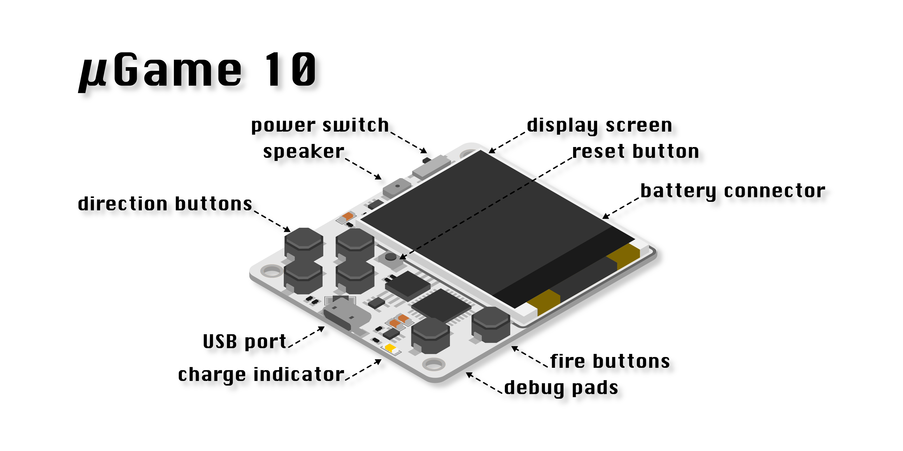

Hardware
********

The most recent version of hardware for this project is µGame 10.

µGame 10
========

Feature Placement
-----------------

Hardware Specification
----------------------

+------------+----------------+
| Processor  | Atmel SAMD21   |
+------------+----------------+
| Clock      | Internal 48MHz |
+------------+----------------+
| Memory     | 32kB           |
+------------+----------------+
| Storage    | 2MB External   |
+------------+----------------+
| Display    | ST7735R        |
+------------+----------------+
| Resolution | 128×128        |
+------------+----------------+
| Color      | 16-bit         |
+------------+----------------+
| Audio      | Mono 8-bit     |
+------------+----------------+
| Buttons    | 6              |
+------------+----------------+

Battery Notes
-------------

For logistic reasons the µGame 10 is shipped without a battery. The user has to
attach and solder the battery themselves. Pretty much any lithium battery will
work with the built-in battery charger, but as the charger works at 400mA, it
is important that the battery can be charged with that current. Usually this
means that the battery has to be at least 400mAh in size. The Nokia BL-5B
battery is recommended, as it has the right size and shape, stores around
800mAh, and is contained in a safe package that fits well on the back of the
device.

Note that to charge the battery, the power switch has to be on while the device
is connected to the USB port.
