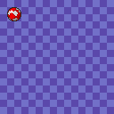

Bouncing Ball Tutorial
**********************

To learn how to write games for µGame, it's best to start with a practical
example. We will try to make a simple demo, showing on the screen a moving
ball, bouncing off the screen edges. It's very simple, but demonstrates some
of the most important concepts that you will need to know.

Clean Slate
===========

We don't want anything to interfere in our tutorial, so let's start with making
sure that everybody is starting with the same state. There are probably some
files on your µGame right now — perhaps a demo program it came with, perhaps
the remnants of earlier experimentation. Please copy those files somewhere safe
on your computer, and then delete all the files from the `CIRCUITPY` drive.

The Main File
=============

Now, create a file called `main.py`, and open it in a text editor. This is
going to be where we put all the code. Later on, with more complex projects,
you will be probably using multiple Python files, but for now everything will
go into `main.py`.

Please also open a serial console, as described in the usage manual, so that
you can see all the messages and errors.

Now type the first few lines of the program, and save it::

    import ugame
    import stage

Once you hit "save", you should see in the console that the board restarts and
runs your program. For now there should be no effect of running it, it just
imports the two libraries that we are going to use later. If you made a mistake
somewhere, however, you will see an error printed on the console, telling you
the line number where the error is. Correct it and save again, and the board
will restart again and run your code.

You won't find the Python files for those two libraries on your device, because
they are included in the firmware directly. The first one, `ugame`, gives you
access to all the hardware of your device: the display, the buttons, the audio
output, the battery voltage, etc. The second one, `stage`, is a very basic game
library, giving you an easy way to draw tiled maps and sprites on the screen.
`There is complete documentation for that library, if you are curious.
<http://circuitpython-stage.readthedocs.io>`_.

Banks
=====

All the graphics used in µGame is organized into so-called "banks": sets of 16
images, 16×16 pixels each, with a 16-color palette. You probably noticed that
we like the number 16 — it really simplifies a lot of things.

For our bouncing ball demo, we are only going to use a single bank, because we
only need 5 images: one for the background, and four for the animated ball. The
bank we are going to use looks like this:

.. image:: images/ball.bmp

Now please right-click on that image, select "save as", and save it onto your
`CIRCUITPY` disk as `ball.bmp`, next to the `main.py` file. This way we will be
able to load it into memory and use in our demo.

.. note::
    The code reading the graphics files on µGame is very simple, and so the
    files need to be in a very specific format. It has to be a 16-color BMP
    file, 16 pixels wide and 256 pixels high. Make sure that your graphics
    program can save such files.

If you look at the image, you will notice that it has all the 16 square images
stacked together one on top of the other, and that it uses a bright magenta
color for the background. That magenta color (100% red, 0% green, 100% blue) is
going to always be considered a "transparent" color. This is useful when we
want our image of the ball to be round, and not square.

Now let's add to our program some code for loading that graphics into memory::

    import ugame
    import stage

    bank = stage.Bank.from_bmp16("ball.bmp")

When you save this, nothing will be displayed, but the file will be read and
prepared to be used by our program. If there is any problem with the file, you
will get an error on the console.

Grids
=====

Now that we have our graphics loaded into memory, we can display it. There are
several ways we can do this, but in this case we are going to use a `Grid`.
What is a grid? It's a map of square tiles, each of them 16×16, all coming from
the same bank. Each square of the map can display a different tile from the
bank, so you can use them to display levels. Let's create a grid using our
bank::

    import ugame
    import stage

    bank = stage.Bank.from_bmp16("ball.bmp")
    background = stage.Grid(bank)

By default a grid is the same size as the screen, so 16×16 squares. You can
also specify width and height, to create a grid of a different size, but for
now this is enough for us. Now, how do you display it on the screen?

Stage
=====

To actually display anything, we will need a `Stage` object — that represents
the whole screen of your game, with all the things that need to be displayed.
Those things are organized into layers — starting from the ones closest to you,
and going deeper. The order of layers is important, because they will cover
each other. For now, we only have one thing to be displayed, our grid, so we
only need one layer::

    import ugame
    import stage

    bank = stage.Bank.from_bmp16("ball.bmp")
    background = stage.Grid(bank)
    game = stage.Stage(ugame.display, 12)
    game.layers = [background]
    game.render_block()

When you save this code, you will finally see something on the screen: a blue
checkered background. That is because a new grid is by default displaying the
first tile in the bank, and that is the blue tile, repeated 128 times.

The command that actually displayed it on the screen is `redner_block`. You are
going to call it in your program at least once, at the beginning. Without any
parameters it will simply redraw the whole screen. You can also use this and
other methods to only redraw parts of the screen — and we are going to do that
later on, as it is much faster than redrawing the whole screen every time. But
you need to draw it all at the beginning, so there we go.

.. note::
    You are probably wondering what that number 12 is doing there. We will need
    it later, when we are actually doing any animations: this is the number of
    frames per second (FPS) that our game is going to run at. You might be used
    to playing games where you have 300 fps or more, but on this kind of
    hardware, 12 or 24 fps is pretty standard.

Sprite
======

Let's display our ball now. We could create another grid, but instead let's try
something new: a `Sprite`. Sprites are 16x16 images representing things in your
game such as the player character, the monsters, the items, the bullets, the
explosions, etc. Unlike grids, they can only display one image at a time, but
you can change that image and move it around the screen easily. So let's modify
our code to include a sprite::

    import ugame
    import stage

    bank = stage.Bank.from_bmp16("ball.bmp")
    background = stage.Grid(bank)
    ball = stage.Sprite(bank, 1, 8, 8)
    game = stage.Stage(ugame.display, 12)
    game.layers = [ball, background]
    game.render_block()

The parameters you have to pass are the bank, the image from that bank, and the
x and y coordinates of the sprite. You can also see that we added our sprite to
the layers. This is important, otherwise it wouldn't be displayed. It also has
to be in the list before the background, otherwise it wouldn't be visible.
When you save this code, you should see our ball on the screen.

Animations
==========

Now let's make that ball animated. The simplest way to do it is by spinning it
— that is, making the sprite display a different image every frame. We can do
that by adding a loop to our program::

    import ugame
    import stage

    bank = stage.Bank.from_bmp16("ball.bmp")
    background = stage.Grid(bank)
    ball = stage.Sprite(bank, 1, 8, 8)
    game = stage.Stage(ugame.display, 12)
    game.layers = [ball, background]
    game.render_block()

    while True:
        ball.set_frame(ball.frame % 4 + 1)
        game.render_sprites([ball])
        game.tick()

If you are familiar with Python, you will know that `while True:` makes things
be repeated over and over again infinitely. Now, `set_frame` will change the
frame displayed by our sprite — we want it to go 1, 2, 3, 4, 1, 2, 3, 4, ...
because we only have 4 frames of animation of the ball. The modulo operator `%`
takes care of that. Next, we call `render_sprites` to re-draw our sprite on the
screen, and then `tick()` will wait for the next frame, making sure there are
exactly 12 of them per second, as we specified when we created the stage.

Movement
========

Now let's try to move the ball from where it spins, and make it travel across
the screen. To do that, we can use the `move` method of the sprite, just like
we changed its frame::

    import ugame
    import stage

    bank = stage.Bank.from_bmp16("ball.bmp")
    background = stage.Grid(bank)
    ball = stage.Sprite(bank, 1, 8, 8)
    game = stage.Stage(ugame.display, 12)
    game.layers = [ball, background]
    game.render_block()

    dx = 2
    while True:
        ball.update()
        ball.set_frame(ball.frame % 4 + 1)
        ball.move(ball.x + dx, ball.y)
        if not 0 < ball.x < 112:
            dx = -dx
        game.render_sprites([ball])
        game.tick()

We had to add one more complication. The `update` method of the sprite saves
its old position in a temporary memory, so that when we call `render_sprites`,
both the old position of the sprite and the new one can be updated. If we
didn't call it, we would have leftovers of the previous ball drawn on the
screen. You can try it by commenting out that line.

Multiple Balls
==============

Now, suppose we wanted to have more moving objects in our game. Obviously we
need more sprites, and the code to move all those sprites. Putting it all in
the main loop like we did so far may be a little bit too messy. So we can
subclass the `Sprite` class, and create our dedicated sprites, with behavior
included::

    import ugame
    import stage

    class Ball(stage.Sprite):
        def __init__(self, x, y):
            super().__init__(bank, 1, x, y)
            self.dx = 2
            self.dy = 1

        def update(self):
            super().update()
            self.set_frame(self.frame % 4 + 1)
            self.move(self.x + self.dx, self.y + self.dy)
            if not 0 < self.x < 112:
                self.dx = -self.dx
            if not 0 < self.y < 112:
                self.dy = -self.dy

    bank = stage.Bank.from_bmp16("ball.bmp")
    background = stage.Grid(bank)
    ball1 = Ball(64, 0)
    ball2 = Ball(0, 76)
    ball3 = Ball(111, 64)
    game = stage.Stage(ugame.display, 12)
    sprites = [ball1, ball2, ball3]
    game.layers = [ball1, ball2, ball3, background]
    game.render_block()

    while True:
        for sprite in sprites:
            sprite.update()
        game.render_sprites(sprites)
        game.tick()

Now, the `__init__` method of our new class handles creating a new sprite and
setting its initial parameters, and the extended `update` method handles the
behavior. Of course you can have many different classes if you want to have
different behaviors. The `super()` call is a way to call the original method of
the `Sprite` class.

Text
====

Often you will have to display some messages for the player. Whether it is the
current score count, the character's dialogue or the traditional "game over".
You can do it by using yet another kind of layer, the `Text` layer::

    import ugame
    import stage

    class Ball(stage.Sprite):
        def __init__(self, x, y):
            super().__init__(bank, 1, x, y)
            self.dx = 2
            self.dy = 1

        def update(self):
            super().update()
            self.set_frame(self.frame % 4 + 1)
            self.move(self.x + self.dx, self.y + self.dy)
            if not 0 < self.x < 112:
                self.dx = -self.dx
            if not 0 < self.y < 112:
                self.dy = -self.dy

    bank = stage.Bank.from_bmp16("ball.bmp")
    background = stage.Grid(bank)
    text = stage.Text(12, 1)
    text.move(16, 60)
    text.text("Hello world!")
    ball1 = Ball(64, 0)
    ball2 = Ball(0, 76)
    ball3 = Ball(111, 64)
    game = stage.Stage(ugame.display, 12)
    sprites = [ball1, ball2, ball3]
    game.layers = [text, ball1, ball2, ball3, background]
    game.render_block()

    while True:
        for sprite in sprites:
            sprite.update()
        game.render_sprites(sprites)
        game.tick()

Conclusion
==========

This is as far as we are going to go with this simple demo. Hopefully it will
help you on your journey to becoming an experienced game developer!
